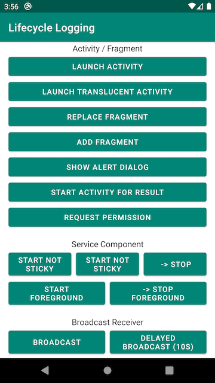

# android-lifecycle-logging
Sample app that logs important lifecycle events of components like Activities / Fragments, Services, etc. when the app is in use.

Intented to be used as reminder of the ordering of lifecycle callbacks (like for interview prep) and NOT as an indicator of best practices.

Touch the buttons on the main screen to launch or start/stop various components, then watch Logcat for logs with the name *LifecycleLogging*. Try also rotating the device to force configuration changes, swiping the app away after starting a service or initiating the delayed broadcast, etc.

